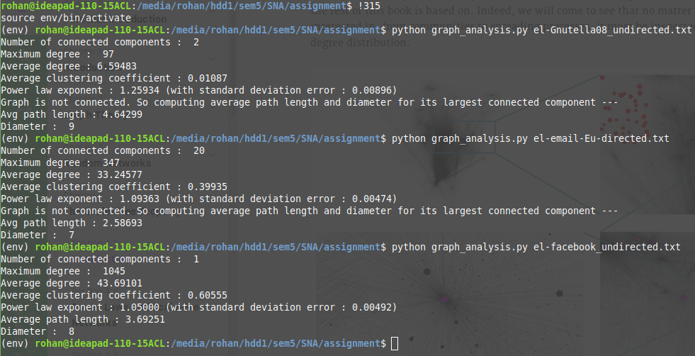

# Social network analysis
### Class Assignment
The following properties of a given network can be calculeted using this project...
+ Number of connected components
+ Maximum degree
+ average Degree
+ Average clustering coefficient
+ Power law exponent
+ Average path length
+ Diameter
## **Demo**

## **Degree distribution following power law**

*Go through the [project report](project_summary.pdf) for more insights*
#
@misc{snapnets,
  author       = {Jure Leskovec and Andrej Krevl},
  title        = {{SNAP Datasets}: {Stanford} Large Network Dataset Collection},
  howpublished = {\url{http://snap.stanford.edu/data}},
  month        = jun,
  year         = 2014
}

